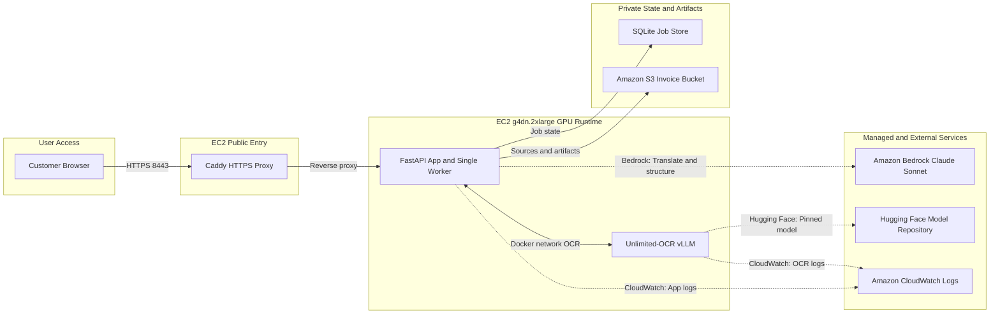
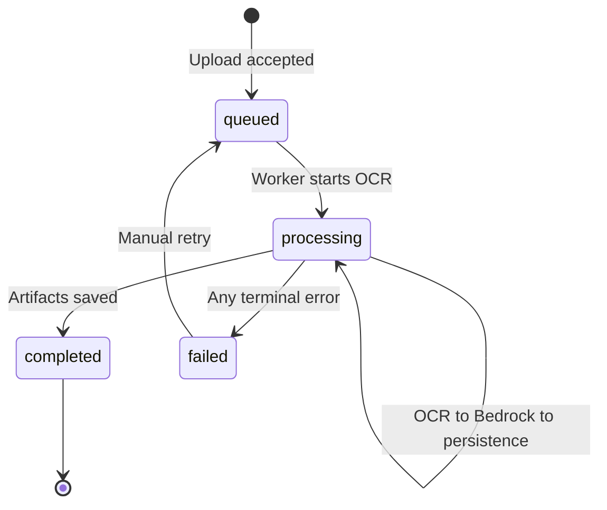

# AWS Unlimited-OCR Invoice Extraction PoC

## Complete as-built technical documentation

| Document attribute | Value |
|---|---|
| System | Invoice Intelligence extraction workspace |
| Document type | As-built architecture, implementation, deployment, and operations guide |
| AWS Region | `ap-south-1` (Mumbai) |
| Runtime model | Single-user, asynchronous, one active OCR job |
| Primary OCR | `baidu/Unlimited-OCR` through vLLM |
| Translation and structuring | Amazon Bedrock Converse with Claude Sonnet 4.6 |
| Infrastructure definition | Terraform with local state |
| Workstation | Windows, PowerShell, VS Code, OpenSSH |
| Document status | Reflects the repository and live PoC verified on 2026-08-06 |

## 1. Purpose and reading guide

This document explains the complete proof of concept from a customer, architecture, engineering, operations, security, and testing perspective. It is deliberately explicit about implementation boundaries.

Statements in this guide use the following meanings:

- **Implemented** means the capability exists in the repository.
- **Live-verified** means it was exercised successfully on the deployed EC2 environment.
- **Target** means an acceptance objective that still requires a representative benchmark or customer confirmation.
- **Out of scope** means the PoC does not provide the capability and must not be presented as though it does.

This is not a production architecture. It is a controlled, single-user validation environment for testing OCR quality, multilingual translation, structured AP extraction, traceability, GPU sizing, latency, and operating cost.

## 2. Executive summary

The PoC accepts PDF, JPEG, and PNG invoices through a browser. The FastAPI application validates the upload, stores the original document in a private S3 bucket, creates a durable SQLite job record, and returns a job identifier immediately. A single in-process worker retrieves the source, renders PDF pages, invokes Baidu Unlimited-OCR on the EC2 NVIDIA T4 GPU, removes model grounding-coordinate tokens, and stores both raw OCR and clean Markdown.

Only the clean OCR Markdown is sent to Amazon Bedrock. The original invoice image is not sent to Bedrock. Claude Sonnet 4.6 translates non-English content to English and maps the text to a strict accounts-payable invoice schema. The application restores unavailable scalar values to JSON `null`, validates the final object with Pydantic, stores the JSON and processing manifest in S3, and exposes results and downloads in the browser.

The runtime is hosted on one `g4dn.2xlarge` EC2 instance with 8 vCPUs, 32 GiB system memory, and one NVIDIA T4 GPU with 16 GB GPU memory. The runtime explicitly uses FP16 because the T4 does not provide native BF16 Tensor Core acceleration. This is an experimental compatibility configuration and must be benchmarked against the model's official BF16 recipe. See the [AWS accelerated-computing instance specifications](https://aws.amazon.com/ec2/instance-types/accelerated-computing/).

## 3. Scope

### 3.1 Implemented capabilities

- Browser upload and results workspace over HTTPS port `8443`.
- PDF, JPEG, and PNG signature validation.
- Maximum file size of 20 MiB and maximum PDF length of 20 pages.
- Explicit rejection of empty, corrupt, unsupported, and encrypted documents.
- DPI warnings for images below the 150 DPI benchmark prerequisite or without DPI metadata.
- Immediate source persistence to S3 and asynchronous job creation.
- One FIFO background worker within the FastAPI application process.
- PDF rendering at 300 DPI.
- Baidu Unlimited-OCR inference on the EC2 GPU.
- Official single-image and multi-image OCR prompt and decoding differences.
- Raw grounding-token output plus cleaned Markdown.
- Bedrock-based English translation and schema-constrained invoice extraction.
- Supplier, buyer, invoice, totals, tax, line-item, payment, evidence, and warning fields.
- `null` for unavailable scalar fields in the final result.
- Evidence-backed field and document trust statuses without fabricated probability claims.
- Private vLLM selected-token likelihood diagnostics aligned to clean OCR evidence.
- Calibration-gated estimated field correctness; disabled by default until benchmark promotion.
- Private, encrypted, versioned S3 traceability artifacts.
- Retryable failed jobs.
- Restart recovery that marks interrupted processing as failed and actionable.
- CloudWatch container logging.
- Windows/PowerShell provisioning, deployment, lifecycle, smoke-test, and VS Code SSH helpers.
- Unit and mocked integration test suite.
- Exact field-value benchmark utility.

### 3.2 Explicitly out of scope

- Multiple concurrent OCR jobs.
- Autoscaling, load balancing, or high availability.
- SQS, EventBridge, Step Functions, ECS, EKS, or Lambda orchestration.
- ERP posting, payment execution, or purchase-order matching workflows.
- Maker-checker or human-review portal.
- Production authentication, authorization, tenant isolation, or user management.
- Public certificate and customer DNS name.
- Antivirus or malware scanning.
- Textract, PaddleOCR, or alternate OCR fallback.
- Automatic model routing by language or document quality.
- Production-grade calibrated confidence without completion of the labelled promotion benchmark.
- Production database, distributed locking, or multi-worker coordination.
- Guaranteed India-only Bedrock processing.

## 4. Architecture

### 4.1 Editable architecture diagram

[Open the editable architecture diagram in FigJam](https://www.figma.com/board/exL40zbRnwDGkbNTWttrd6?utm_source=other&utm_content=edit_in_figjam&architecture=true).

The version-controlled Mermaid source is stored at [`docs/architecture/unlimited-ocr-poc-architecture.mmd`](architecture/unlimited-ocr-poc-architecture.mmd).



### 4.2 Component inventory

| Component | Deployment | Responsibility |
|---|---|---|
| Customer browser | User workstation | Upload, polling, source preview, results, evidence, retry, and artifact downloads |
| Caddy | `proxy` container | Self-signed HTTPS termination, compression, security headers, reverse proxy |
| FastAPI application | `app` container | UI, REST API, validation, S3 access, job repository, worker, OCR and Bedrock clients |
| Job worker | Thread inside `app` | Serial FIFO job processing; not independently deployable |
| SQLite | `app-data` Docker volume | Job status, stage, timings, errors, artifact map, and completed result cache |
| Unlimited-OCR vLLM | `ocr` GPU container | Page-image to raw Markdown and grounding tokens |
| Amazon S3 | Private AWS bucket | Original sources and all traceability artifacts |
| Amazon Bedrock | Managed AWS service | English translation and structured invoice mapping from clean Markdown |
| CloudWatch Logs | Managed AWS service | `app`, `ocr`, and `proxy` container log streams |
| Hugging Face | External model repository | Initial download of the pinned Unlimited-OCR revision into the persistent model cache |

### 4.3 Important architecture clarification

There is no managed message queue. The application uses `queue.Queue` inside the one FastAPI process. SQLite persists job state, but it does not persist the in-memory queue itself. On startup:

- jobs still marked `queued` are loaded and enqueued;
- jobs that were `processing` when the application stopped are marked `failed` with an interruption message;
- a user can manually retry those failed jobs.

This behavior is appropriate for the PoC but is not a substitute for SQS or another durable queue in production.

## 5. AWS infrastructure

### 5.1 Network

Terraform creates:

- VPC CIDR: `10.42.0.0/16`.
- Public subnet CIDR: `10.42.1.0/24`.
- Internet gateway and default route `0.0.0.0/0`.
- One Elastic IP associated with the EC2 instance.
- One security group with:
  - TCP `22` from `trusted_cidr` only;
  - TCP `8443` from `trusted_cidr` only;
  - unrestricted outbound connectivity for AWS APIs, package repositories, container images, and model download.

The `trusted_cidr` Terraform variable requires `/32`, intentionally limiting browser and SSH access to one public IPv4 address.

### 5.2 EC2 compute

| Setting | Implemented value |
|---|---|
| Instance type | `g4dn.2xlarge` by default |
| Operating system | Latest Deep Learning Base OSS NVIDIA Driver GPU AMI, Ubuntu 24.04 |
| AMI resolution | Public SSM parameter at Terraform plan/apply time |
| Root volume | 150 GiB `gp3`, encrypted, deleted on instance termination |
| GPU | One NVIDIA T4 with 16 GB VRAM |
| Instance metadata | IMDSv2 tokens required |
| EC2 monitoring | Detailed monitoring enabled |
| Instance role | S3, Bedrock, CloudWatch Logs, and SSM permissions |

The AMI is resolved from:

```text
/aws/service/deeplearning/ami/x86_64/base-oss-nvidia-driver-gpu-ubuntu-24.04/latest/ami-id
```

AWS documents the parameter and current releases in the [Ubuntu 24.04 Base GPU DLAMI guide](https://docs.aws.amazon.com/dlami/latest/devguide/aws-deep-learning-x86-base-gpu-ami-ubuntu-24-04.html). Because this parameter points to the latest image, a future Terraform replacement may use a newer AMI than the one originally deployed.

### 5.3 S3

The bucket name follows:

```text
<project-name>-<aws-account-id>-<region>
```

Controls:

- All four public-access-block settings are enabled.
- Object ownership is `BucketOwnerEnforced`.
- Versioning is enabled.
- Default server-side encryption is SSE-S3 (`AES256`).
- Current and noncurrent objects expire after 30 days.
- `force_destroy = false`; Terraform will not silently delete a non-empty evidence bucket.

### 5.4 IAM

The EC2 role grants:

- `s3:ListBucket` on the one artifact bucket.
- `s3:GetObject`, `s3:PutObject`, and `s3:AbortMultipartUpload` under `incoming/*` and `results/*` only.
- `bedrock:InvokeModel` and `bedrock:InvokeModelWithResponseStream` with resource `*`.
- CloudWatch log stream creation, description, and event publication to the PoC log group.
- `AmazonSSMManagedInstanceCore` through an AWS-managed policy.

AWS access keys are not copied to EC2 or placed in `.env`. Boto3 uses the EC2 instance profile through the standard credential provider chain.

### 5.5 CloudWatch Logs

- Log group: `/<project-name>/app`.
- Retention: 30 days.
- Streams configured by Docker Compose: `app`, `ocr`, and `proxy`.
- The AWS `awslogs` Docker logging driver sends container stdout and stderr.

## 6. Runtime and container topology

Docker Compose runs three services on its private network.

### 6.1 `proxy`

- Image: `caddy:2.10.2-alpine`.
- Host exposure: `8443:8443`.
- Upstream: `app:8000`.
- TLS: Caddy internal certificate authority for the Elastic IP.
- Compression: Zstandard and gzip.
- Headers:
  - `Strict-Transport-Security: max-age=31536000`;
  - `X-Content-Type-Options: nosniff`;
  - `X-Frame-Options: SAMEORIGIN`;
  - `Referrer-Policy: no-referrer`;
  - server identity removed.

The certificate warning is expected because the private CA is not trusted by the user's operating system. Traffic remains encrypted after the user accepts the warning.

### 6.2 `app`

- Base image: `python:3.12-slim-bookworm`.
- Runs as a non-root system user named `app`.
- Uvicorn binds to `0.0.0.0:8000` with one worker.
- Port 8000 is available only inside the Compose network.
- Health endpoint: `/api/health`.
- Persistent volume: `app-data:/app/data`.
- Database: `/app/data/jobs.db`.
- Starts only after the OCR service passes its health check.

### 6.3 `ocr`

- Image pinned by digest:

```text
vllm/vllm-openai@sha256:542961a42d9183813819a23ef3a8b50bfb4f5ef7b0fb4f8e4f56edd8445efb18
```

- Model revision pinned to:

```text
d549bb9d6a055dbe291408916d66acc2cd5920f6
```

- Model ID and served name: `baidu/Unlimited-OCR`.
- Compute dtype: configurable through `OCR_DTYPE`, defaulting to `float16` for T4 compatibility.
- Vision attention backend: configurable through `OCR_MM_ENCODER_ATTN_BACKEND`, defaulting to `TORCH_SDPA` because FlashAttention 2 does not support the T4's compute capability 7.5.
- GPU reservation: one NVIDIA GPU.
- Shared memory: 16 GiB.
- IPC: host.
- Model cache volume: `hf-cache:/root/.cache/huggingface`.
- Context: `--max-model-len 32768`.
- GPU memory utilization: `0.85`.
- Prefix caching disabled.
- Multimodal processor cache disabled.
- Custom Unlimited-OCR n-gram logits processor registered.
- Health check: `GET http://127.0.0.1:8000/health`.
- Health start period: 20 minutes to allow initial image and model download.

The prompt and decoding behavior follows the [official vLLM Unlimited-OCR recipe](https://recipes.vllm.ai/baidu/Unlimited-OCR).

## 7. End-to-end processing flow

### 7.1 Upload and synchronous validation

1. The browser submits `multipart/form-data` to `POST /api/jobs`.
2. FastAPI reads at most `max_upload_bytes + 1` bytes.
3. The filename is reduced to its basename to avoid path traversal through the supplied name.
4. Validation uses file signatures, not the extension supplied by the browser:
   - PDF: `%PDF-`;
   - PNG: standard eight-byte PNG signature;
   - JPEG: `FF D8 FF`.
5. Empty and oversized files are rejected.
6. PDFs are opened with PyMuPDF:
   - corrupt/unreadable files are rejected;
   - password-protected PDFs are rejected;
   - zero-page PDFs are rejected;
   - documents above the configured page limit are rejected.
7. Images are verified by Pillow.
8. Image DPI metadata is inspected:
   - below 150 DPI creates a warning;
   - missing DPI creates a warning;
   - these conditions do not block the PoC request.
9. A UUID job identifier is generated.
10. The original is written to S3 before the job is queued.
11. A SQLite record is created with status and stage `queued`.
12. The job ID is added to the worker queue.
13. HTTP `202 Accepted` is returned without waiting for OCR or Bedrock.

### 7.2 Worker and source retrieval

The single daemon worker thread reads one job ID at a time. It updates the record to:

```text
status=processing, stage=ocr
```

It then downloads the source bytes from S3 using the stored key.

### 7.3 Image preparation

- JPEG and PNG inputs are written unchanged to a temporary per-request directory.
- PDF pages are rendered to PNG with PyMuPDF.
- Render scale is `pdf_render_dpi / 72`; the default is 300 DPI.
- Alpha is disabled for PDF rendering.
- Temporary images are deleted automatically after OCR returns or fails.

### 7.4 Unlimited-OCR invocation

The app calls the private vLLM OpenAI-compatible endpoint:

```text
POST http://ocr:8000/v1/chat/completions
```

Single-page request:

| Parameter | Value |
|---|---|
| Prompt | `<image>document parsing.` |
| Mode | Automatic gundam/crop mode for one image |
| N-gram size | `35` |
| Window size | `128` |

Multi-page request:

| Parameter | Value |
|---|---|
| Prompt | `<image>Multi page parsing.` |
| Mode | Automatic base/non-crop mode for multiple images |
| N-gram size | `35` |
| Window size | `1024` |

Common generation settings:

- temperature `0.0`;
- `skip_special_tokens = false`;
- one-page maximum output tokens `4096`;
- multi-page maximum output tokens `8192`;
- request timeout `1800` seconds.

The model has a 32,768-token total context. The application must not request 32,768 output tokens because that would leave no room for prompt or image input and vLLM would reject every request. The PoC uses a smaller 4,096-token ceiling for the common one-page case to limit unnecessary T4 generation time while retaining the official recipe's 8,192-token ceiling for multi-page documents.

### 7.5 OCR retry and cleanup

OCR has two total attempts:

1. Run the normal request.
2. If it fails, best-effort POST to `reset_mm_cache` and `reset_prefix_cache`.
3. Ignore missing administrative endpoints because they vary by vLLM release and the related caches are disabled.
4. Run Python garbage collection.
5. Wait one second.
6. Retry once.
7. If the second attempt fails, mark the job failed.

HTTP status failures include up to 2,000 characters of the vLLM error message in the job error, making the frontend actionable without exposing the document payload.

For every successful OCR response, the application records the vLLM `finish_reason`, token `usage`, requested token ceiling, page mode, and page count. This metadata is stored separately from the raw document text and copied into the manifest.

### 7.6 OCR cleanup and persistence

The raw response may contain:

- `<|det|>...<|/det|>` category and coordinate blocks;
- `<|ref|>...<|/ref|>` text markers;
- image regions that do not contain textual output.

The cleanup function:

- preserves block and reading order;
- strips reference tokens;
- removes coordinate metadata;
- drops image-only regions;
- retains text and table Markdown.

Both versions are stored before Bedrock begins:

```text
results/<job-id>/ocr/raw.txt
results/<job-id>/ocr/clean.md
```

The job moves to `stage=bedrock` and records `ocr_seconds`.

### 7.7 Bedrock translation and structured extraction

The application sends only clean OCR Markdown to Bedrock. It does not send the original image or rendered pages.

Default model:

```text
global.anthropic.claude-sonnet-4-6
```

The client uses the Bedrock Runtime `Converse` operation in `ap-south-1`, with a global inference profile. Claude Sonnet 4.6 supports structured outputs; see the [AWS model card](https://docs.aws.amazon.com/bedrock/latest/userguide/model-card-anthropic-claude-sonnet-4-6.html) and [AWS structured-output guide](https://docs.aws.amazon.com/bedrock/latest/userguide/structured-output.html).

System rules require the model to:

- use only supplied OCR content;
- translate non-English content to English;
- avoid inventing missing values;
- preserve monetary strings as shown;
- copy short exact evidence snippets;
- provide field-specific evidence paths for every populated scoreable scalar;
- return `Unknown` for non-invoices;
- add warnings for uncertainty;
- omit self-assessed confidence scores.

#### Structured-output transport detail

The canonical application schema permits many `string | null` values. Sending all nullable unions directly caused Bedrock to reject the compiled grammar as too large. The implementation now:

1. builds the canonical Pydantic JSON Schema;
2. creates a compact transport schema;
3. removes titles, descriptions, and defaults;
4. replaces nullable-string unions with required strings;
5. tells the model to use an empty string when a scalar is missing;
6. receives schema-valid JSON from Bedrock;
7. restores empty strings to `null` using the canonical schema;
8. validates the final `InvoiceExtraction` object with Pydantic.

This keeps Bedrock structured outputs while preserving the required final `null` semantics.

### 7.8 Bedrock retries

Default attempts: three.

Retryable service codes:

- `InternalServerException`;
- `ModelNotReadyException`;
- `ModelTimeoutException`;
- `ServiceUnavailableException`;
- `ThrottlingException`;
- `TooManyRequestsException`.

Backoff is exponential with random jitter, capped by the implemented `min(8, 2^(attempt-1))` delay. Non-retryable client errors stop immediately. Parsing, transport, and validation failures are retried up to the configured attempt count.

The response diagnostics retain Bedrock `stopReason`, token `usage`, latency metrics, and a key-only description of the response shape. If Bedrock returns no text block, processing fails safely with the stop reason and content-block count rather than raising an index error. Document text is not copied into these diagnostics.

### 7.9 Completion

After Bedrock succeeds:

1. Validation warnings from upload are prepended to result warnings if not already present.
2. `bedrock_seconds` is recorded.
3. Stage becomes `persisting`.
4. Structured JSON is stored in S3.
5. `total_seconds` is recorded.
6. The manifest is written.
7. SQLite is updated with status and stage `completed`, timestamps, timings, artifact keys, and the completed JSON object.

### 7.10 Failure

Any unhandled processing error:

- is logged with a stack trace;
- records total elapsed time;
- produces a failure manifest when S3 is still available;
- updates SQLite to status and stage `failed`;
- exposes the error through `GET /api/jobs/{job_id}`;
- enables the manual retry action in the UI.

## 8. Job state model



The API exposes a finer-grained `stage` alongside the overall `status`:

| Status | Typical stage | Meaning |
|---|---|---|
| `queued` | `queued` | Stored and waiting for the worker |
| `processing` | `ocr` | Source retrieval, rendering, or OCR |
| `processing` | `bedrock` | Translation and schema mapping |
| `processing` | `persisting` | Final JSON and manifest writes |
| `completed` | `completed` | Result and all completion artifacts available |
| `failed` | `failed` | Error visible; manual retry allowed |

`validating` exists in the stage enum but synchronous upload validation currently happens before the job record is created, so a persisted job does not normally enter that stage.

## 9. API reference

### 9.1 `GET /`

Returns the customer-facing HTML application.

### 9.2 `GET /api/health`

Response:

```json
{
  "status": "ok",
  "worker_enabled": true,
  "ocr_model": "baidu/Unlimited-OCR",
  "bedrock_model": "global.anthropic.claude-sonnet-4-6"
}
```

This endpoint verifies application responsiveness, not deep S3, GPU, OCR-model, or Bedrock readiness.

### 9.3 `POST /api/jobs`

Request:

```http
Content-Type: multipart/form-data
file=<PDF, JPEG, or PNG bytes>
```

Success: HTTP `202`.

```json
{
  "job_id": "4e8f2f44-5f8f-42aa-8d5a-7052d2d5fe5f",
  "status": "queued",
  "created_at": "2026-08-06T16:15:11.242112Z"
}
```

Common errors:

| HTTP | Condition |
|---|---|
| `400` | Empty, unsupported, corrupt, encrypted, oversized, or over-page-limit input |
| `502` | Source could not be persisted to object storage |

### 9.4 `GET /api/jobs/{job_id}`

Returns the full `JobRecord`, including:

- identifiers and source metadata;
- status and stage;
- timestamps;
- retry count;
- validation warnings;
- stage timings;
- artifact keys;
- error when failed;
- result object when completed.
- trust assessment when completed and available.

Malformed or unknown UUIDs return HTTP `404`.

### 9.5 `POST /api/jobs/{job_id}/retry`

- Only a `failed` job may be retried.
- Success returns HTTP `202` with the updated job.
- Non-failed jobs return HTTP `409`.
- Retry clears the failed Bedrock result and related terminal state, increments `retry_count`, and reuses the same source and job ID.
- If `ocr/clean.md` exists, the retry preserves the successful OCR artifacts, likelihood diagnostics, and OCR timing and resumes directly at Bedrock. If clean OCR is missing or cannot be read, the worker safely falls back to OCR. Historical OCR without likelihoods is never rerun solely to obtain diagnostics.

### 9.6 `GET /api/jobs/{job_id}/artifacts/{name}`

Valid names:

- `source`;
- `raw`;
- `clean`;
- `ocr_metadata`;
- `ocr_likelihoods`;
- `result`;
- `trust`;
- `manifest`.

The source is returned inline with its media type. Other artifacts use `Content-Disposition: attachment` and an explicit filename. Missing artifacts return HTTP `404`.

## 10. Final invoice data contract

All objects reject unknown properties during Pydantic validation.

### 10.1 Top-level object

| Field | Type | Meaning |
|---|---|---|
| `document_type` | string | `Invoice` only when supported by content; otherwise `Unknown` |
| `source_languages` | string array | Languages detected in OCR content |
| `translated_markdown` | string | English representation retaining useful structure |
| `supplier` | object | Supplier identity and evidence |
| `buyer` | object | Buyer identity and evidence |
| `invoice` | object | Identifiers, dates, currency, terms, and evidence |
| `totals` | object | Amounts, taxes, and evidence |
| `line_items` | object array | Original and English descriptions plus amounts |
| `payment` | object | Bank and payment identifiers |
| `warnings` | string array | Ambiguities, missing fields, and validation notes |
| `field_evidence` | object array | JSON field path plus exact OCR snippets for each populated scoreable field |

### 10.2 Nested fields

Supplier and buyer:

- `name`;
- `address`;
- `tax_id`;
- `evidence[]`.

Invoice details:

- `invoice_number`;
- `purchase_order_number`;
- `invoice_date`;
- `due_date`;
- `currency`;
- `payment_terms`;
- `evidence[]`.

Totals:

- `subtotal`;
- `discount`;
- `shipping`;
- `tax_total`;
- `grand_total`;
- `amount_due`;
- `taxes[]` with `tax_type`, `base_amount`, `rate`, `amount`, and `evidence[]`;
- `evidence[]`.

Line item:

- `description_original`;
- `description_english`;
- `quantity`;
- `unit`;
- `unit_price`;
- `tax_amount`;
- `line_total`;
- `evidence[]`.

Payment:

- `bank_name`;
- `account_name`;
- `account_number`;
- `iban`;
- `swift_bic`;
- `evidence[]`.

All unavailable scalar fields above are `null`. Monetary and quantity fields remain strings to preserve source formatting and avoid unsafe floating-point conversion or assumptions about locale-specific separators.

### 10.3 Trust assessment contract

Trust is application-generated after Bedrock validation and is not part of the LLM's self-assessment. `JobRecord.trust` contains:

- assessment, ruleset, and optional calibration versions;
- mode: `signals` or `calibrated`;
- document status: `ready`, `review_required`, or `insufficient_support`;
- per-field status: `supported`, `review`, `unsupported`, or `not_assessed`;
- exact/normalized evidence matches and occurrence counts;
- deterministic AP validation signals and human-readable reasons;
- diagnostic OCR likelihood or `null`;
- calibrated confidence or `null`;
- a mandatory interpretation disclaimer.

The diagnostic likelihood is `exp(mean(token_logprob))` across non-structural vLLM tokens aligned to the evidence span. The assessment also retains tenth-percentile/minimum log-probability and token count. It is a generation-likelihood diagnostic, not a probability of correctness.

In `signals` mode, raw likelihood never changes the customer-facing status. In `calibrated` mode, a promoted offline artifact may expose estimated normalized field-value correctness. Thresholds are `0.90` for supported and `0.70` for review; a lower value is unsupported. Missing likelihoods, malformed token data, Unicode alignment failures, and historical jobs produce `null` rather than a fallback number.

The standard critical fields are supplier name, invoice number/date, currency, subtotal, tax total, grand total, amount due, and each extracted line total. Missing or non-supported critical fields route the document to review or insufficient support. Deterministic checks cover totals arithmetic, line sums, quantity-times-price, amount-due range, date ordering, evidence support, ambiguity, OCR truncation, and source-quality warnings.

## 11. Persistence

### 11.1 S3 object layout

```text
incoming/<job-id>/source.<pdf|jpg|png>
results/<job-id>/ocr/raw.txt
results/<job-id>/ocr/clean.md
results/<job-id>/ocr/metadata.json
results/<job-id>/ocr/token-likelihoods.json.gz
results/<job-id>/bedrock/result.json
results/<job-id>/quality/trust-assessment.json
results/<job-id>/manifest.json
```

### 11.2 Manifest

The manifest contains:

- job ID and terminal status;
- source filename, content type, page count, S3 key, and validation warnings;
- OCR model ID and pinned revision;
- Bedrock model ID;
- current/terminal processing stage;
- vLLM finish reason, usage, requested output limit, and page mode when captured;
- Bedrock stop reason, usage, latency metrics, and key-only response shape when captured;
- trust mode, ruleset, availability, document status, calibration version, and assessment error;
- measured OCR, Bedrock, and total timings when available;
- artifact key map;
- terminal error or `null`;
- UTC generation timestamp.

### 11.3 SQLite job table

| Column | Purpose |
|---|---|
| `id` | UUID primary key |
| `status`, `stage` | Workflow state |
| `filename`, `content_type`, `source_key`, `page_count` | Source metadata |
| `created_at`, `updated_at`, `started_at`, `completed_at` | UTC lifecycle timestamps |
| `error` | Terminal error text |
| `retry_count` | Manual retries |
| `validation_warnings_json` | Upload-quality warnings |
| `timings_json` | Stage durations |
| `artifacts_json` | Logical name to S3 key map |
| `result_json` | Completed structured output for fast API display |

SQLite uses WAL journal mode and a 30-second connection timeout. Each repository operation opens a separate connection.

## 12. Frontend behavior

The UI is implemented with server-rendered HTML, CSS, and browser JavaScript; no frontend build system or third-party JavaScript framework is required.

Capabilities:

- drag/drop or file-picker upload;
- selected file type and size display;
- progress polling every two seconds;
- slower five-second reconnect polling after status-read errors;
- current stage and progress visualization;
- a continuously updating elapsed-time counter while a job is active;
- live OCR/Bedrock activity text showing the active stage and how recently status was confirmed;
- source preview through the artifact endpoint;
- result summary, populated-field counts, tax breakdown, evidence disclosures, line items, translation, and JSON views;
- artifact download links;
- JSON copy action;
- failure message and retry action;
- last job ID stored in browser local storage and restored after refresh;
- responsive layout and reduced-motion support.

Local storage contains only the last job UUID, not invoice contents or extracted data.

## 13. Configuration reference

Settings are loaded through `pydantic-settings`, with environment values overriding code defaults.

| Environment variable | Default | Purpose |
|---|---:|---|
| `AWS_REGION` | `ap-south-1` | S3 and Bedrock client region |
| `S3_BUCKET` | empty | Required when storage backend is S3 |
| `STORAGE_BACKEND` | `s3` | `s3` for AWS or `local` for development/tests |
| `DATA_DIR` | `data` locally, `/app/data` in Compose | SQLite and local-storage base |
| `OCR_BASE_URL` | `http://ocr:8000` | Private vLLM endpoint |
| `OCR_MODEL_ID` | `baidu/Unlimited-OCR` | Request and manifest model ID |
| `OCR_MODEL_REVISION` | pinned SHA | Traceability and model download revision |
| `OCR_DTYPE` | `float16` | Explicit T4-compatible vLLM compute dtype |
| `OCR_MM_ENCODER_ATTN_BACKEND` | `TORCH_SDPA` | T4-compatible vision attention backend |
| `OCR_TIMEOUT_SECONDS` | `1800` | OCR HTTP timeout |
| `OCR_SINGLE_PAGE_MAX_TOKENS` | `4096` | One-page generation budget |
| `OCR_MAX_TOKENS` | `8192` | Multi-page generation budget within 32K total context |
| `OCR_LOGPROBS_ENABLED` | `true` | Capture selected generated-token likelihood diagnostics |
| `BEDROCK_MODEL_ID` | `global.anthropic.claude-sonnet-4-6` | Configurable Bedrock model or inference profile |
| `BEDROCK_MAX_TOKENS` | `16384` | Bedrock response ceiling |
| `BEDROCK_RETRY_ATTEMPTS` | `3` | Total Bedrock attempts |
| `MAX_UPLOAD_BYTES` | `20971520` | 20 MiB upload limit |
| `MAX_PAGES` | `20` | PDF page limit |
| `PDF_RENDER_DPI` | `300` | PDF rasterization resolution |
| `MINIMUM_BENCHMARK_DPI` | `150` | Quality warning and benchmark prerequisite |
| `TRUST_MODE` | `signals` | `signals` hides numerical correctness; `calibrated` requires a promoted artifact |
| `TRUST_CALIBRATION_PATH` | empty | Optional promoted calibration JSON path |
| `TRUST_SUPPORTED_THRESHOLD` | `0.90` | Calibrated supported-field threshold |
| `TRUST_REVIEW_THRESHOLD` | `0.70` | Calibrated review threshold |
| `TRUST_AMOUNT_TOLERANCE` | `0.02` | Decimal tolerance for deterministic financial checks |
| `TRUST_RULESET_VERSION` | `1.0.0` | Traceable trust-rule version |
| `WORKER_ENABLED` | `true` | Enables in-process job worker |
| `CLOUDWATCH_LOG_GROUP` | `/unlimited-ocr-poc/app` | Docker AWS logging target |
| `PUBLIC_HOST` | supplied during deploy | Caddy Elastic-IP listener and certificate name |
| `OCR_IMAGE` | pinned digest | Reproducible vLLM container image |

## 14. Workstation setup

Prerequisites:

- Windows PowerShell;
- AWS CLI;
- Git;
- OpenSSH client and `ssh-keygen`;
- VS Code with Remote - SSH;
- Terraform 1.8 or newer;
- Python 3.12 through 3.14 for local development.

Automated setup:

```powershell
.\scripts\Initialize-Workstation.ps1 -AwsProfile default -InstallTerraform
```

This helper:

- checks AWS CLI and OpenSSH;
- optionally installs Terraform using `winget`;
- creates an Ed25519 key at `%USERPROFILE%\.ssh\unlimited-ocr-poc` when absent;
- starts `aws configure` if the named profile does not exist;
- verifies credentials with STS.

## 15. Terraform provisioning

### 15.1 Variables

Copy the example and set the actual public IPv4 address:

```powershell
Copy-Item .\infra\terraform.tfvars.example .\infra\terraform.tfvars
notepad .\infra\terraform.tfvars
```

Required sensitive-to-environment value:

```hcl
trusted_cidr = "<current-public-ip>/32"
```

### 15.2 Commands from the repository root

```powershell
terraform -chdir=infra init
terraform -chdir=infra fmt -check
terraform -chdir=infra validate
terraform -chdir=infra plan -out=poc.tfplan
terraform -chdir=infra apply poc.tfplan
```

PowerShell should use `-chdir=infra` as Terraform's global flag. Running from inside `infra` should omit `-chdir`:

```powershell
terraform plan -out=poc.tfplan
```

### 15.3 Terraform outputs

- `instance_id`;
- `public_ip`;
- `web_url`;
- `ssh_command`;
- `s3_bucket`;
- `resolved_dlami_id` as sensitive;
- `cloudwatch_log_group`.

### 15.4 Local-state security

This PoC intentionally uses local Terraform state. Treat the following as sensitive operational files and do not commit or email them:

- `infra/terraform.tfstate`;
- `infra/terraform.tfstate.backup`;
- `infra/*.tfplan`;
- `infra/terraform.tfvars`.

For a team or production environment, move state to a locked, encrypted remote backend and introduce a reviewed state-access policy.

## 16. EC2 bootstrap and deployment

Terraform user data:

1. updates apt metadata;
2. installs Git and jq;
3. installs Docker only if absent;
4. installs a Docker Compose package if absent;
5. enables Docker;
6. adds `ubuntu` to the Docker group;
7. configures the NVIDIA container runtime when `nvidia-ctk` exists;
8. creates `/opt/unlimited-ocr-poc`;
9. writes an infrastructure-derived `.env` with mode `0600`;
10. captures a best-effort `nvidia-smi` log;
11. writes a bootstrap-complete marker.

Wait for bootstrap:

```powershell
$sshKey = "$env:USERPROFILE\.ssh\unlimited-ocr-poc"
$server = "ubuntu@$(terraform -chdir=infra output -raw public_ip)"
ssh -i $sshKey $server "sudo cloud-init status --wait"
```

Deploy:

```powershell
.\scripts\Deploy.ps1
```

The deploy helper uploads `app`, `Caddyfile`, Compose files, `pyproject.toml`, and `.dockerignore`, then pulls, builds, and starts the containers. The `PUBLIC_HOST` value comes from the Terraform Elastic IP output.

Initial deployment can take 20 minutes or longer because the vLLM image and model weights must be downloaded and loaded. The persistent `hf-cache` volume reduces subsequent startup time.

## 17. VS Code Remote SSH

Create the SSH host entry:

```powershell
.\scripts\Configure-VSCodeSSH.ps1
```

The default alias is:

```text
unlimited-ocr-poc
```

Then:

1. install VS Code Remote - SSH;
2. choose **Remote-SSH: Connect to Host**;
3. select `unlimited-ocr-poc`;
4. open `/opt/unlimited-ocr-poc`;
5. use the integrated terminal for logs, GPU checks, and controlled restarts.

The SSH identity must be the private key without `.pub`. The `.pub` file is registered with EC2 but cannot authenticate the SSH client.

## 18. Operations runbook

### 18.1 Lifecycle

```powershell
.\scripts\Start.ps1
.\scripts\Stop.ps1
.\scripts\Status.ps1
```

Stop the GPU instance whenever it is idle. Stopping does not remove EBS, S3, CloudWatch, or the Elastic IP allocation.

### 18.2 Container status

```powershell
ssh unlimited-ocr-poc "cd /opt/unlimited-ocr-poc && docker compose -f docker-compose.yml -f docker-compose.aws.yml ps"
```

Expected steady state:

- `ocr`: healthy;
- `app`: healthy;
- `proxy`: running.

### 18.3 Logs

```powershell
ssh unlimited-ocr-poc "cd /opt/unlimited-ocr-poc && docker compose -f docker-compose.yml -f docker-compose.aws.yml logs --tail=200 app"
ssh unlimited-ocr-poc "cd /opt/unlimited-ocr-poc && docker compose -f docker-compose.yml -f docker-compose.aws.yml logs --tail=200 ocr"
ssh unlimited-ocr-poc "cd /opt/unlimited-ocr-poc && docker compose -f docker-compose.yml -f docker-compose.aws.yml logs --tail=200 proxy"
```

Follow a stream by adding `-f`.

### 18.4 GPU checks

```powershell
ssh unlimited-ocr-poc "nvidia-smi"
ssh unlimited-ocr-poc "docker exec unlimited-ocr-poc-ocr-1 nvidia-smi"
```

Or run the bundled smoke test:

```powershell
.\scripts\Smoke-TestEC2.ps1
```

### 18.5 Safe application-only restart

```powershell
ssh unlimited-ocr-poc "cd /opt/unlimited-ocr-poc && docker compose -f docker-compose.yml -f docker-compose.aws.yml up -d --build --no-deps app"
```

This preserves the loaded OCR container. Any job actively processing during an application restart will be marked failed and must be retried.

## 19. Testing

### 19.1 Local automated suite

```powershell
python -m venv .venv
.\.venv\Scripts\Activate.ps1
python -m pip install -e '.[dev]'
python -m pytest -q
python -m ruff check app tests benchmark
```

Current suite: 23 passing tests at the time of this document.

Coverage includes:

- signature-based validation;
- valid image handling;
- corrupt, empty, oversized, encrypted, and page-limit rejection;
- source artifact API;
- job creation, status, and retry rules;
- unknown job handling;
- SQLite create, update, and restart recovery;
- OCR grounding-token cleanup;
- official single and multi-page request parameters;
- OCR server error visibility;
- Bedrock throttling retry;
- structured-output transport schema compaction;
- restoration of empty transport values to `null`;
- S3-compatible key layout through local storage;
- traversal-safe local object keys;
- successful artifact persistence;
- OCR retry after temporary failure;
- failed-job manifest behavior.

### 19.2 GPU smoke tests

The environment should verify:

- host `nvidia-smi`;
- Docker GPU access;
- OCR container health;
- model loading;
- one-page OCR;
- multi-page OCR;
- application health;
- browser access through Caddy.

### 19.3 Accuracy benchmark

The benchmark utility performs normalized exact field-value comparison. It ignores evidence, translated Markdown, warnings, and source-language fields, then flattens nested JSON paths and line-item indices.

Prepare at least 20 labelled invoices across English, Hindi, and Tamil, including:

- clean digital invoices;
- scanned tables;
- multi-page invoices;
- missing fields;
- degraded scans;
- multiple tax entries;
- non-invoice inputs.

Run:

```powershell
python .\benchmark\evaluate.py .\benchmark\labels.jsonl .\benchmark\results --output .\benchmark\report.json
```

Target: at least `0.85` exact field-value accuracy for invoices meeting the 150 DPI prerequisite.

This target is **not yet proven** by the repository alone. A representative labelled benchmark must be completed before making an accuracy claim to a customer.

### 19.4 Confidence calibration benchmark

Confidence calibration is separate from the 20-document extraction-accuracy smoke benchmark. Collect at least 100 labelled invoices, targeting 150, and include `metadata.language`, `metadata.quality_bucket`, and `metadata.page_count` in every label. Download each completed job's result JSON and trust-assessment JSON into separate directories.

Run:

```powershell
python .\benchmark\calibrate_confidence.py .\benchmark\labels.jsonl .\benchmark\results .\benchmark\trust --output .\benchmark\calibration.json --version calibration-v1
```

The standard-library trainer splits by invoice into 60% training, 20% isotonic calibration, and 20% held-out testing, stratified by language and quality bucket where the available data permits. It fits standardized logistic field-correctness features and then a monotonic isotonic mapping. The exported JSON contains feature definitions, means/scales, coefficients, intercept, isotonic breakpoints, dataset fingerprint, split seed, held-out metrics, group reports, and promotion result.

Promotion requires all of the following:

- held-out expected calibration error at most `0.10`;
- Brier score better than the base-rate baseline;
- at least `0.95` exact correctness among critical fields displayed at `>=0.90`;
- at least `0.80` recall for incorrect critical fields routed below `0.90`.

If any gate fails, the artifact remains `promoted=false`; the runtime refuses to expose its percentages and the UI remains in evidence-signals mode.

## 20. Verified sample behavior

One live Hindi invoice completed successfully after the final OCR and Bedrock corrections:

| Measurement | Observed value |
|---|---:|
| OCR | 5.905 seconds |
| Bedrock | 43.207 seconds |
| Total | 49.320 seconds |
| Terminal status | `completed` |
| Artifacts | raw, clean, OCR metadata/likelihoods, result, trust assessment, manifest |

This is a single observed sample, not an SLA, throughput claim, or statistically valid benchmark.

## 21. Acceptance criteria and current evidence

| Criterion | Status | Evidence or gap |
|---|---|---|
| Completed job produces schema-valid JSON | Implemented and unit-tested | Pydantic validation after Bedrock response |
| Completed job produces traceability and trust artifacts | Implemented and unit-tested | Raw, clean, OCR diagnostics, result, trust assessment, and manifest generated |
| At least 85% field-value accuracy at 150+ DPI | Target, not yet proven | Requires 20+ labelled invoice benchmark |
| Missing fields remain `null` | Implemented and unit-tested | Transport empty strings restored via canonical schema |
| Critical populated fields have evidence snippets | Implemented in schema and prompt | Requires benchmark review for evidence correctness |
| Raw OCR likelihood is never presented as calibrated confidence | Implemented and unit-tested | Signals mode exposes badges; diagnostics remain explicitly uncalibrated |
| Calibrated percentage promotion gates pass | Target, not yet proven | Requires 100+ labelled invoices; target 150 |
| Invalid and encrypted inputs fail safely | Implemented and unit-tested | Validation errors are actionable |
| OCR and Bedrock failures are visible and retryable | Implemented and tested | Failure manifest plus retry endpoint |
| Restart interruption is visible and retryable | Implemented and tested | Processing jobs become failed at startup |
| S3 remains private | Implemented in Terraform | Public block and bucket ownership controls |
| Ports restricted to configured `/32` | Implemented in Terraform | Security group ingress only 22 and 8443 |
| English, Hindi, and Tamil measured | Target, not yet proven | Benchmark dataset still required |

## 22. Troubleshooting guide

### Terraform command is not recognized

Cause: Terraform is not installed or the terminal has not reloaded PATH.

```powershell
.\scripts\Initialize-Workstation.ps1 -InstallTerraform
```

Close and reopen PowerShell, then run `terraform -version`.

### Terraform reports too many command-line arguments

Use the global flag with an equals sign from the repository root:

```powershell
terraform -chdir=infra plan -out=poc.tfplan
```

If already inside `infra`, use:

```powershell
terraform plan -out=poc.tfplan
```

### `Push-Location .\infra` points to `infra\infra`

The terminal is already in the `infra` directory. Return to the repository root or run Terraform without `-chdir`.

### SSH times out

Check:

- EC2 is running;
- `trusted_cidr` matches the current public IP with `/32`;
- Terraform changes were applied after an IP change;
- port 22 is not blocked by the corporate network;
- Elastic IP output is current.

### SSH identity warning references a remote command as the key

PowerShell variables were missing or line continuation was parsed incorrectly. Use explicit values:

```powershell
ssh -i "$env:USERPROFILE\.ssh\unlimited-ocr-poc" ubuntu@<public-ip> "cd /opt/unlimited-ocr-poc && docker compose ps"
```

### Host-key mismatch after instance replacement

Remove the exact current IP, not a truncated address:

```powershell
ssh-keygen -R <public-ip>
```

Then reconnect and verify the new fingerprint through an authoritative AWS source when required by policy.

### `cloud-init status --wait` reports error

Inspect:

```powershell
ssh unlimited-ocr-poc "sudo cloud-init status --long"
ssh unlimited-ocr-poc "sudo tail -n 200 /var/log/cloud-init-output.log"
```

The current bootstrap avoids installing `docker.io` when Docker is already present, preventing a package conflict with `containerd.io` on the DLAMI.

### OCR stays in `health: starting`

Initial image and model download can take 20 minutes or more. Check:

```powershell
ssh unlimited-ocr-poc "cd /opt/unlimited-ocr-poc && docker compose logs --tail=200 ocr"
ssh unlimited-ocr-poc "nvidia-smi"
```

### Browser reports `ERR_SSL_PROTOCOL_ERROR`

Confirm:

- the `proxy` container is running;
- port `8443` is published;
- `PUBLIC_HOST` equals the current Elastic IP;
- the Caddyfile uses `https://{$PUBLIC_HOST}:8443`;
- the proxy was recreated after changing host configuration.

### OCR returns HTTP 400 about maximum context length

Cause: requesting 32,768 output tokens leaves no context for input.

Expected configuration:

```text
OCR_SINGLE_PAGE_MAX_TOKENS=4096
OCR_MAX_TOKENS=8192
```

### Bedrock reports compiled grammar is too large

Use the implemented compact transport schema. Do not revert to the canonical Pydantic schema containing many nullable-string unions.

### Bedrock permission or model-access failure

Verify:

- the EC2 instance profile is attached;
- Bedrock model access is enabled for the account;
- the selected model/inference profile is available;
- the IAM role allows the required invoke actions;
- the configured model ID is correct.

### A job fails after an application restart

This is expected PoC recovery behavior. The source remains in S3. Use the UI retry button or `POST /api/jobs/{job_id}/retry`. If clean OCR was already persisted, the worker resumes at Bedrock and does not spend GPU time repeating OCR.

## 23. Security and privacy assessment

### 23.1 Implemented controls

- One `/32` ingress boundary for SSH and web access.
- No public S3 access.
- Encryption in transit between browser and Caddy.
- SSE-S3 encryption at rest.
- Encrypted EBS root volume.
- EC2 instance role instead of static AWS access keys.
- IMDSv2 required.
- Non-root FastAPI container user.
- Private FastAPI and OCR ports inside Docker networking.
- Security headers at Caddy.
- 30-day S3 and log retention.
- Restricted S3 object prefixes in IAM.
- Filename basename normalization and local-key traversal checks.
- Structured validation of model output.

### 23.2 Gaps before production

- No application authentication or authorization.
- Self-signed TLS rather than a public certificate.
- No Web Application Firewall.
- No antivirus or content-disarm step.
- No Secrets Manager integration because the current runtime has no application secret.
- Broad Bedrock resource scope in the IAM policy.
- Public subnet and direct Elastic IP.
- Unrestricted egress.
- No VPC endpoints for S3, Bedrock, CloudWatch, or SSM.
- No customer-managed KMS keys.
- No CloudTrail-specific controls in this stack.
- No immutable audit store.
- No formal data-classification enforcement or redaction.
- Global Bedrock inference can process text outside Mumbai.
- Browser local storage retains the last job UUID on the device.

## 24. Cost model

Primary cost drivers:

1. `g4dn.2xlarge` running hours.
2. 150 GiB gp3 storage, including while EC2 is stopped.
3. Elastic IP pricing under the current AWS public IPv4 model.
4. Bedrock input and output tokens.
5. S3 storage, versioning, and requests.
6. CloudWatch Logs ingestion and retention.
7. EC2 detailed monitoring.
8. Data transfer when applicable.

Cost-control practices:

- stop EC2 whenever idle;
- keep S3 and CloudWatch retention at 30 days for the PoC;
- measure OCR runtime and Bedrock token use on representative invoices;
- compare G4dn FP16 latency and accuracy with the documented BF16 baseline after collecting representative metrics;
- avoid repeated model downloads by retaining the model cache volume;
- do not claim an exact monthly cost until runtime, volume, Bedrock tokens, and regional pricing are measured.

## 25. Teardown

Interactive destroy:

```powershell
.\scripts\Destroy.ps1
```

Noninteractive destroy when explicitly intended:

```powershell
.\scripts\Destroy.ps1 -AutoApprove
```

The S3 bucket uses `force_destroy = false`. If it contains sources or artifacts, Terraform destroy will stop rather than deleting evidence. Before emptying the bucket:

1. confirm the retention and customer-data decision;
2. download any artifacts that must be retained;
3. remember that versioning means current and noncurrent versions must both be removed;
4. obtain any required customer or security approval;
5. rerun destroy and verify no billable resources remain.

## 26. Production evolution path

Recommended sequence:

### Phase 1: secure access

- Put the application behind an Application Load Balancer or CloudFront.
- Use ACM-managed TLS and a DNS name.
- Add an enterprise identity provider and role-based authorization.
- Add WAF and request-size enforcement at the edge.
- Move compute to private subnets and use SSM Session Manager instead of public SSH.

### Phase 2: durable orchestration

- Replace the in-process queue with SQS.
- Separate API and GPU worker deployments.
- Add visibility timeouts, dead-letter queues, idempotency, and distributed locking.
- Move job state from SQLite to DynamoDB or PostgreSQL.
- Support controlled horizontal scaling after GPU-capacity and concurrency tests.

### Phase 3: review and integration

- Add a human-review workflow for warnings and low-quality documents.
- Add evidence-to-field navigation.
- Add PO/receipt matching and ERP connectors only after schema ownership is agreed.
- Add audit events for every review and correction.

### Phase 4: governance and operations

- Add KMS keys, VPC endpoints, CloudTrail, vulnerability scanning, backup policy, alarms, dashboards, and incident runbooks.
- Establish accuracy, latency, and availability SLOs from measured data.
- Build regression datasets by supplier, language, layout, and scan quality.
- Implement approved data residency and retention controls.

## 27. Repository map

```text
app/
  main.py                 FastAPI routes and application lifecycle
  config.py               Environment-backed settings
  database.py             SQLite repository and recovery
  schemas.py              Job and invoice Pydantic models
  services/
    validation.py         File signature, page, encryption, and DPI checks
    storage.py            S3 and safe local storage adapters
    ocr.py                PDF rendering, vLLM request, cleanup, OCR errors
    bedrock.py             Translation, structured output, retries, null restoration
    processor.py           Worker, stages, timings, artifacts, manifests
  templates/index.html    Customer-facing interface
  static/                 CSS and browser JavaScript
  Dockerfile              Non-root FastAPI image
infra/
  versions.tf             Terraform and provider constraints
  variables.tf            Inputs and validation
  main.tf                 Network, SG, EC2, EIP, log group, AMI resolution
  iam.tf                  EC2 role and policies
  storage.tf              S3 controls and lifecycle
  outputs.tf              Connection and resource outputs
  user_data.sh.tftpl      EC2 bootstrap
scripts/                  Windows setup, deploy, SSH, lifecycle, and smoke tests
tests/                    Unit and mocked integration tests
benchmark/                Label example and exact-value evaluator
docs/                     As-built documentation and diagram source
```

## 28. Design decisions and rationale

| Decision | Rationale | Consequence |
|---|---|---|
| One EC2 GPU host | Fastest PoC path with direct GPU control | No HA and coupled app/model lifecycle |
| `g4dn.2xlarge` | T4 capacity fallback with 32 GiB system memory and 16 GB VRAM | FP16 departs from the official BF16 recipe and requires accuracy and latency validation |
| Unlimited-OCR only | Keeps the core extraction evaluation unambiguous | No fallback resilience |
| Bedrock receives Markdown only | Preserves Unlimited-OCR as the extraction engine and reduces multimodal duplication | Bedrock cannot visually correct OCR mistakes |
| SQLite plus one worker | Simple, inspectable single-user async flow | Not horizontally scalable or durably queued |
| Private S3 with artifacts | Traceability and repeatable evaluation | Requires explicit retention and teardown handling |
| Strings for financial values | Preserves OCR formatting and avoids locale/rounding assumptions | Downstream ERP integration needs normalization rules |
| Calibration-gated trust model | Shows evidence-backed review status immediately without misrepresenting model likelihood | Numerical correctness remains unavailable until benchmark promotion |
| Global Bedrock profile | Access to selected model and structured outputs | May not satisfy India-only processing |
| Internal Caddy CA | Encrypted PoC access without DNS | Browser trust warning |
| Pinned OCR image and revision | Reproducibility | Upgrades require explicit compatibility testing |

## 29. External references

- [Baidu Unlimited-OCR model card](https://huggingface.co/baidu/Unlimited-OCR)
- [Official vLLM Unlimited-OCR recipe](https://recipes.vllm.ai/baidu/Unlimited-OCR)
- [AWS EC2 accelerated-computing instances](https://aws.amazon.com/ec2/instance-types/accelerated-computing/)
- [AWS Deep Learning Base GPU AMI for Ubuntu 24.04](https://docs.aws.amazon.com/dlami/latest/devguide/aws-deep-learning-x86-base-gpu-ami-ubuntu-24-04.html)
- [Amazon Bedrock Claude Sonnet 4.6 model card](https://docs.aws.amazon.com/bedrock/latest/userguide/model-card-anthropic-claude-sonnet-4-6.html)
- [Amazon Bedrock structured outputs](https://docs.aws.amazon.com/bedrock/latest/userguide/structured-output.html)

## 30. Customer demonstration checklist

Before a demonstration:

- [ ] Confirm EC2 is running.
- [ ] Confirm current public IP still matches the security-group `/32`.
- [ ] Confirm `ocr`, `app`, and `proxy` are healthy.
- [ ] Confirm Bedrock model access.
- [ ] Confirm the browser has accepted the private certificate warning.
- [ ] Prepare one clean English invoice and one representative multilingual invoice.
- [ ] Avoid customer-sensitive production data unless approved.
- [ ] Explain that AP means Accounts Payable.
- [ ] Show the source preview before results.
- [ ] Show OCR Markdown and English translation.
- [ ] Show evidence snippets and warnings.
- [ ] Show the trust legend, overall review status, and field badges.
- [ ] State that OCR likelihood is diagnostic unless a promoted calibration version is displayed.
- [ ] Download result JSON and the manifest.
- [ ] State that the 85% target requires completion of the labelled benchmark.
- [ ] Stop EC2 after the demonstration.

## 31. Open items

- Execute and publish the 20+ document English/Hindi/Tamil benchmark.
- Collect 100+ labelled invoices (target 150), train the offline calibrator, and publish held-out ECE/Brier/tier metrics before enabling `TRUST_MODE=calibrated`.
- Confirm the customer's data residency requirement before production design.
- Measure Bedrock token consumption by language and invoice length.
- Measure multi-page GPU memory, CPU, and RAM usage.
- Test a representative 20-page invoice within the 32K OCR context.
- Decide whether non-invoice inputs should complete as `Unknown` or be routed to review.
- Decide production identity, retention, KMS, network, and ERP requirements.
- Evaluate whether a smaller G6 instance meets performance and stability needs.
